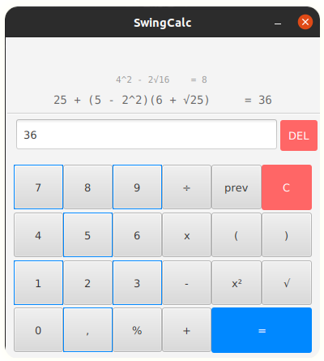

# SwingCalc: Simple calculator with Java
> Library: `JavaFX`

> #### After open project, maven install dependencies automatically.

**<center>SwingCalc UI</center>**

> ###Lookup environment variable `production` in Env.java .

# Download SwingCalc
got to release section and download **swingcalc-`version`.deb**,

### requirement: java 

Set `JAVA_HOME=/your_java_path` in `/etc/environment` <br />
or install jre with.

```bash
sudo apt install openjdk-17-jre
```

> Note: if java is installed, and you don't know java path,
> use <br /> ``` which java```

# Install
here, current directory is location of swingcalc-1.2.1.deb file

```bash
sudo dpkg -i ./swingcalc-1.2.1.deb
```

Finally,  check this in **applications launcher** or use command 
`swingcalc`

